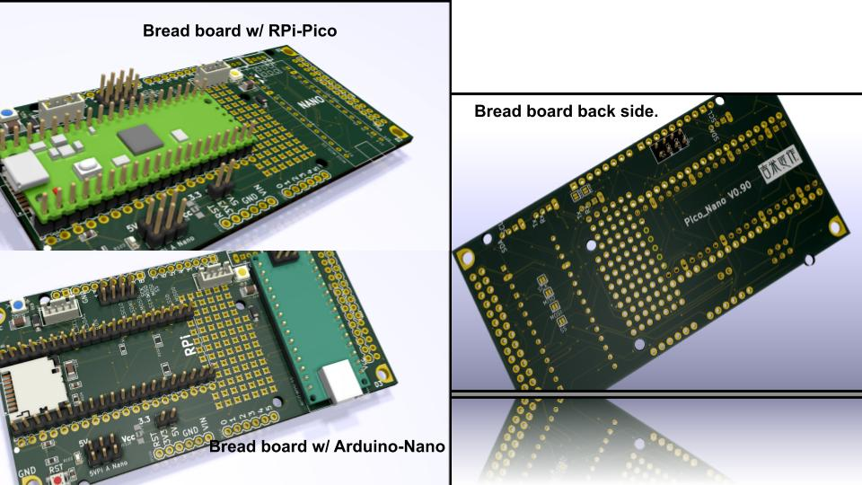

# RPi-Pico  
### Interesting projects based on RPi-Pico 
 
My "free size" UNO bread board w/ RPi-Pico & Arduino-Nano!

RPi_Pico Pinout from (https://www.raspberrypi.org/documentation/pico/getting-started/)

## References
  - [RPi_Pico](https://www.raspberrypi.org/documentation/pico/getting-started/) Pico Getting Started!
  
  
