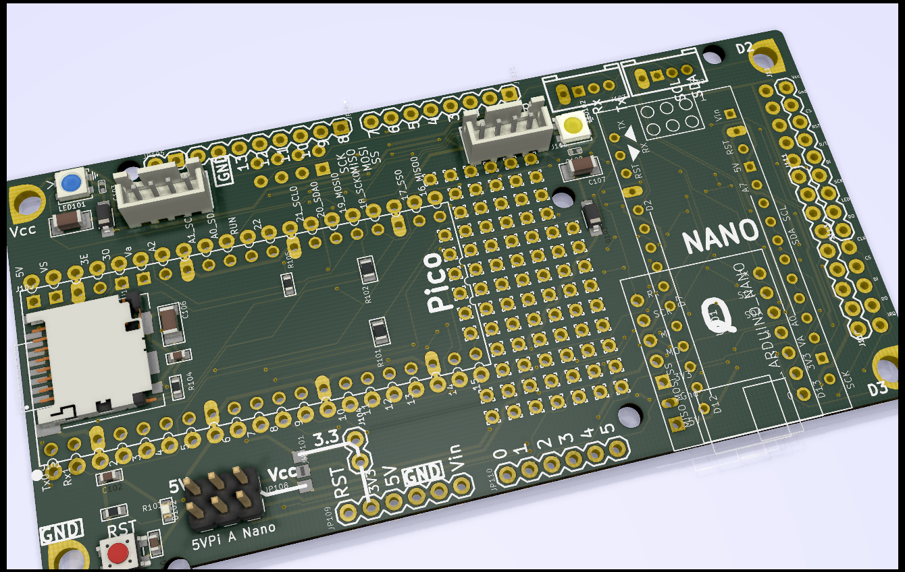
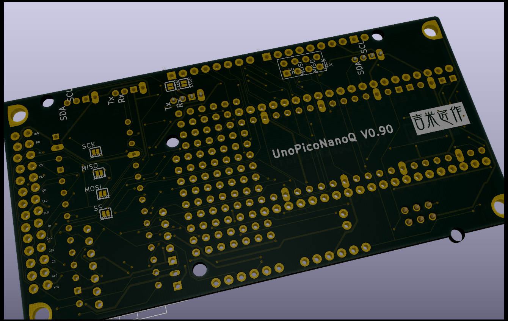
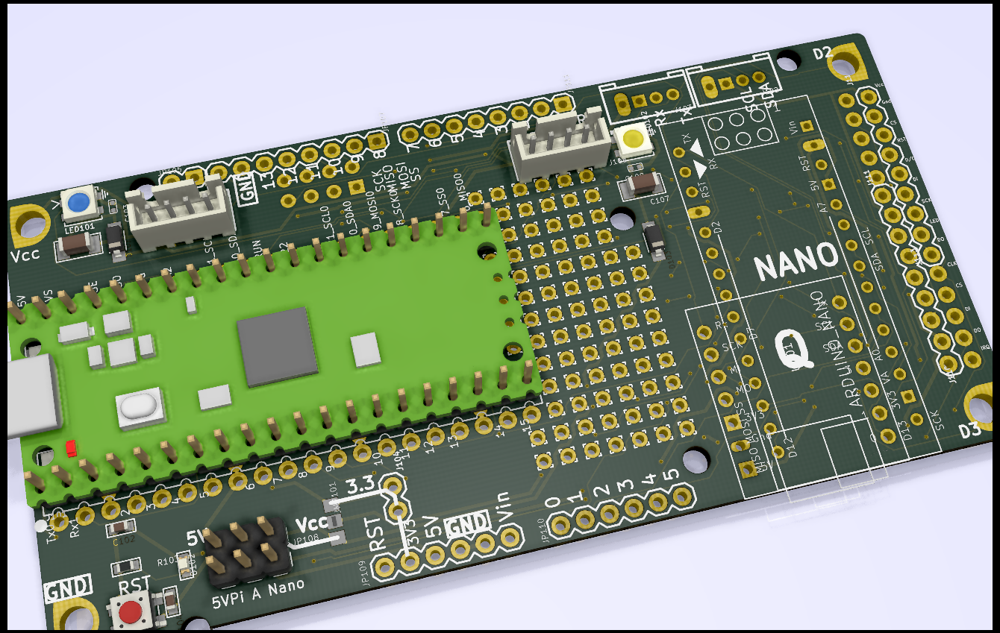
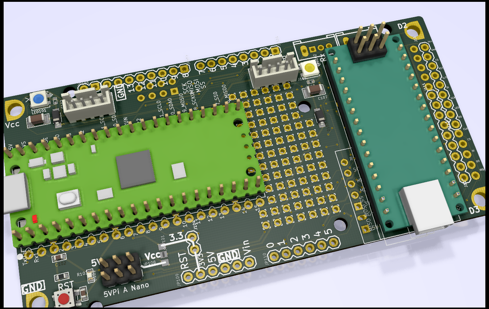
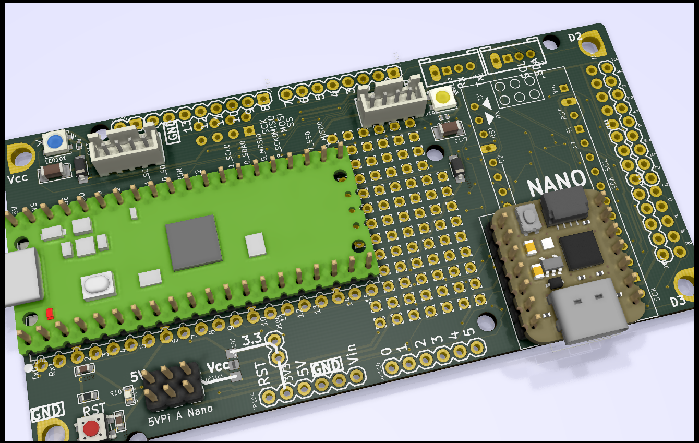
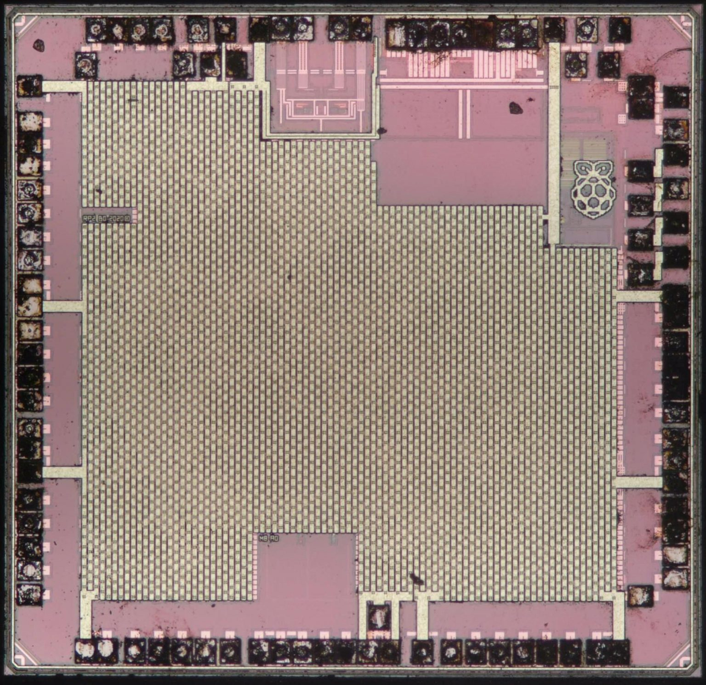

# Party Time, Arms!  
### Interesting projects based on RPi-Pico  _(Work-in-Progress)_ 
 
My UNO bread-board w/ RPi-Pico, Arduino-Nano, Adafruit QtPy, SEEED Xiao!
With some added features:
 - Neopixel RGB LEDs.
 - Shared I2C, SPI, UART, A/D & SD card.
 - 5V/3V3 power source selectable.
 - SPI LCD interface w/ touch.
 - Arduino-Uno/Mega compatible size/Holes.
 

  
(w/ Nano) 
(w/ QtPy or Xiao) 
 
 

RPi_Pico Pinout from (https://www.raspberrypi.org/documentation/pico/getting-started/)

 
 
Zoomable RP2040 top layer:
https://siliconpr0n.org/map/raspberry-pi/rp2-b0/mz_mit20x/  

RP2040 chip teardown:
https://buzzchronicles.com/Mollyycolllinss/b/tech/10662/  

Another inside description posted at [Tiny Transistors](https://www.tinytransistors.net/2021/01/27/raspberry-pi-pico/)  

 
 
 

## References  
  -[RPi_Pico](https://www.raspberrypi.org/documentation/pico/getting-started/) Pico Getting Started! 
  -[Arduino RP2040 Connect](https://blog.arduino.cc/2021/01/20/welcome-raspberry-pi-to-the-world-of-microcontrollers/) Arduino board for RP2040. 
  -[Adafruit QtPy](https://www.adafruit.com/qtpy) Another SAMD21 dev. board.  
 

