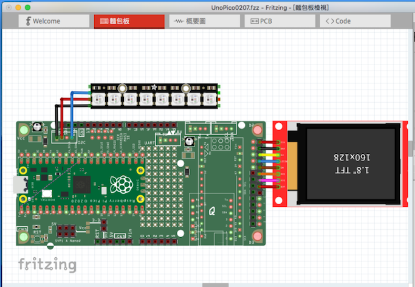

# Party Time, Arms!  
### Interesting projects based on RPi-Pico  _(Work-in-Progress)_ 
 
An UNO bread-board w/ RPi-Pico, Arduino-Nano, Adafruit QtPy, SEEED Xiao!
With some added features:
 - Neopixel RGB LEDs.
 - Shared I2C, SPI, UART, A/D & SD card.
 - 5V/3V3 power source selectable.
 - SPI LCD interface w/ touch.
 - Arduino-Uno/Mega compatible size/Holes. 
    

  
(w/ Nano) 
(w/ QtPy or Xiao) 
 
 

Fritzing part made by Eagle2Fritzing: 
Parts located at here:(https://github.com/jmysu/RPi-Pico/tree/main/hardware/Fritzing/FritzingUnoPico/bins) 
   

 
RPi_Pico Pinout from (https://www.raspberrypi.org/documentation/pico/getting-started/)

 
 
### Pico Pinout Terminal Diagram ### 
curl https://gabmus.org/pico_pinout
Raspberry Pi Pico pinout diagram
Raspberry Pi Pico pinout diagram

                                              ┌╌ LED (GP25)
                                              ┆ ┏━━━━┓          
                                          ┌─────┃    ┃─────┐
UART0 TX | I2C0 SDA | SPI0 RX  | GP0  | 01│●  ┆ ┗━━━━┛    ●│40 | VBUS
UART0 RX | I2C0 SCL | SPI0 CSn | GP1  | 02│●  ⏄           ●│39 | VSYS
                                 GND  | 03│■              ■│38 | GND
           I2C1 SDA | SPI0 SCK | GP2  | 04│●    ╭─╮       ●│37 | 3V3_EN
           I2C1 SCL | SPI0 TX  | GP3  | 05│●    │ │       ●│36 | 3V3(OUT)
UART1 TX | I2C0 SDA | SPI0 RX  | GP4  | 06│●    ╰─╯       ●│35 |          | ADC_VREF
UART1 RX | I2C0 SCL | SPI0 CSn | GP5  | 07│●              ●│34 | GP28     | ADC2
                                 GND  | 08│■              ■│33 | GND      | AGND
           I2C1 SDA | SPI0 SCK | GP6  | 09│●   ┌─────┐    ●│32 | GP27     | ADC1     | I2C1 SCL
           I2C1 SCL | SPI0 TX  | GP7  | 10│●   │     │    ●│31 | GP26     | ADC0     | I2C1 SDA
UART1 TX | I2C0 SDA | SPI1 RX  | GP8  | 11│●   │     │    ●│30 | RUN
UART1 RX | I2C0 SCL | SPI1 CSn | GP9  | 12│●   └─────┘    ●│29 | GP22
                                 GND  | 13│■              ■│28 | GND
           I2C1 SDA | SPI1 SCK | GP10 | 14│●              ●│27 | GP21     |          | I2C0 SCL
           I2C1 SCL | SPI1 TX  | GP11 | 15│●              ●│26 | GP20     |          | I2C0 SDA
UART0 TX | I2C0 SDA | SPI1 RX  | GP12 | 16│●              ●│25 | GP19     | SPI0 TX  | I2C1 SCL
UART0 RX | I2C0 SCL | SPI1 CSn | GP13 | 17│●              ●│24 | GP18     | SPI0 SCK | I2C1 SDA
                                 GND  | 18│■              ■│23 | GND
           I2C1 SDA | SPI1 SCK | GP14 | 19│●              ●│22 | GP17     | SPI0 CSn | I2C0 SCL | UART0 RX
           I2C1 SCL | SPI1 TX  | GP15 | 20│●     ● ■ ●    ●│21 | GP16     | SPI0 RX  | I2C0 SDA | UART0 TX
                                          └────────────────┘
                                                 ┆ ┆ ┆
                                                 ┆ ┆ └╌ SWDIO
                                                 ┆ └╌╌╌ GND
                                                 └╌╌╌╌╌ SWCLK

Power
Ground
UART
GPIO, PIO, PWM
ADC
SPI
I2C
System Control
Debugging
                         
 

Zoomable RP2040 top layer:
https://siliconpr0n.org/map/raspberry-pi/rp2-b0/mz_mit20x/  

RP2040 chip teardown:
https://buzzchronicles.com/Mollyycolllinss/b/tech/10662/  

Another inside description posted at [Tiny Transistors](https://www.tinytransistors.net/2021/01/27/raspberry-pi-pico/)  

 
 
 

## References  
  -[RPi_Pico](https://www.raspberrypi.org/documentation/pico/getting-started/) Pico Getting Started! 
  -[Arduino RP2040 Connect](https://blog.arduino.cc/2021/01/20/welcome-raspberry-pi-to-the-world-of-microcontrollers/) Arduino board for RP2040. 
  -[Adafruit QtPy](https://www.adafruit.com/qtpy) Another SAMD21 dev. board. 
  -[Eagle2Fritzing](https://github.com/squix78/eagle2fritzing-parent) A nice tool converts Eagle .brd to Fritzing part.  

