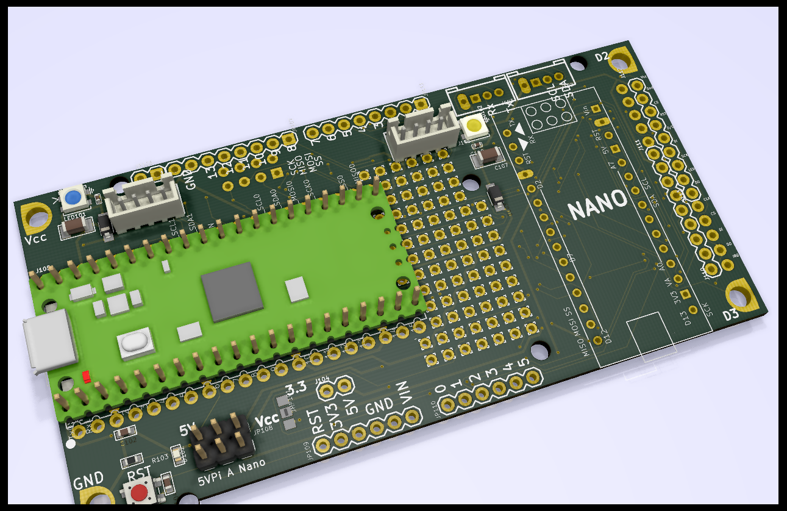
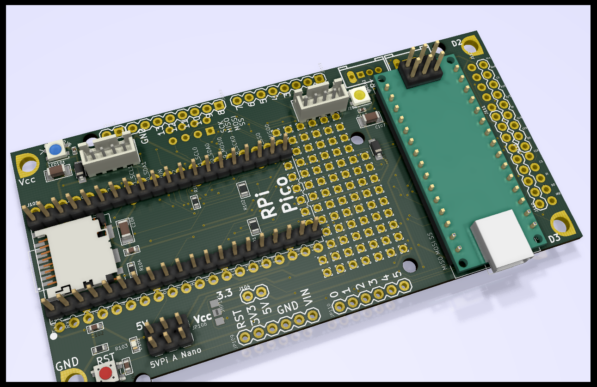
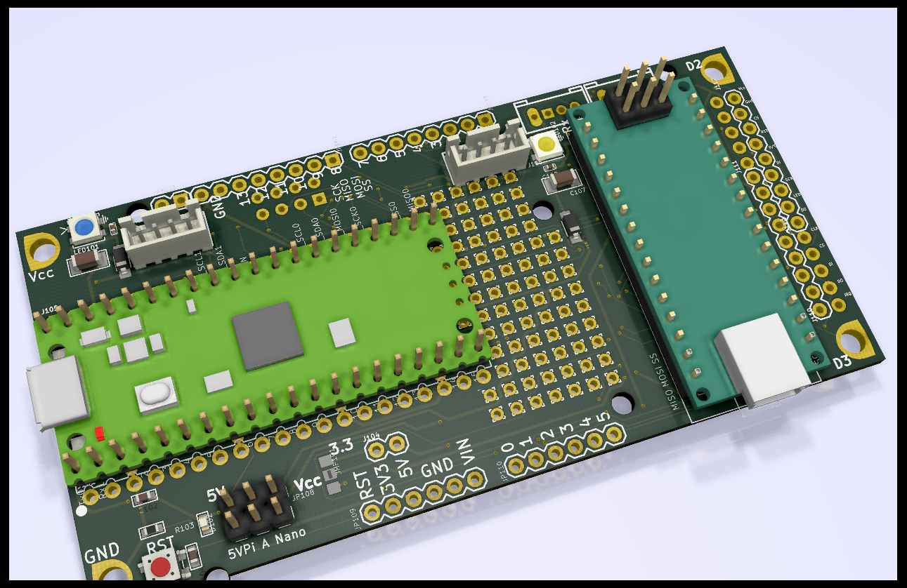
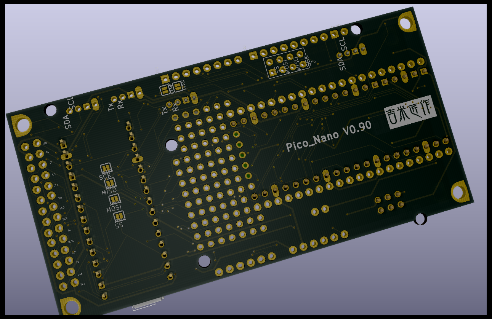
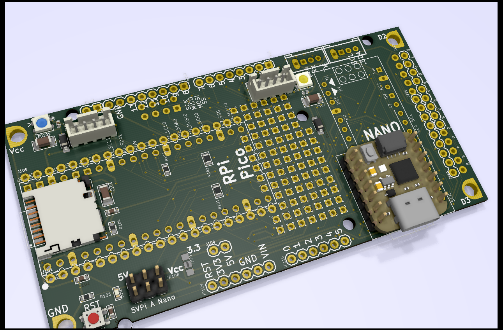
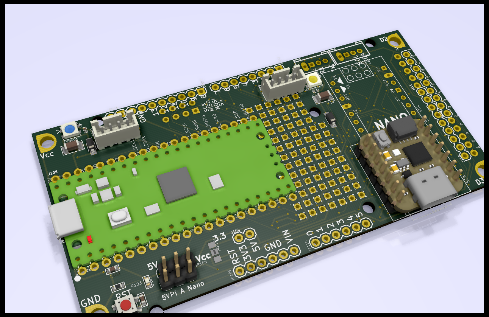
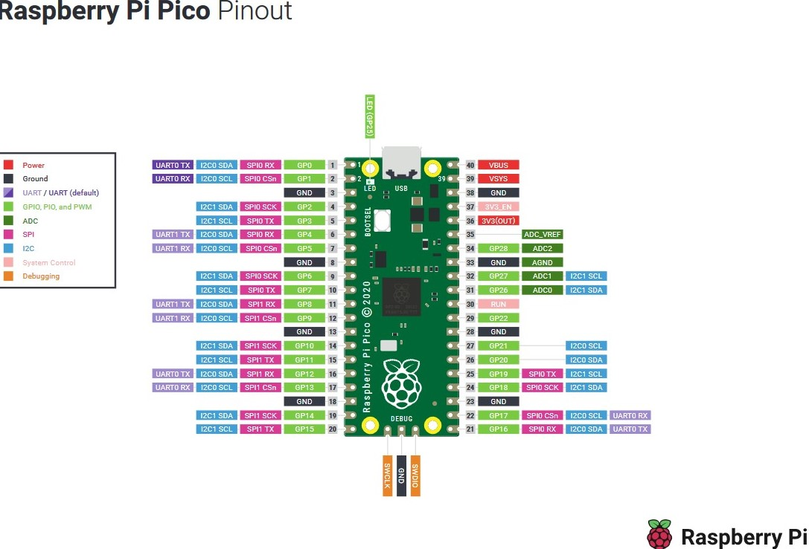

# RPi-Pico  
### Interesting projects based on RPi-Pico 
 
My UNO bread-board w/ RPi-Pico & Arduino-Nano/Adafruit QtPy/SEEED Xiao!
With some added features:
 - Neopixel RGB LEDs.
 - Shared I2C, SPI, UART, A/D & SD card.
 - 5V/3V3 selectable.
 - SPI LCD modulable compatible w/ touch.
 - Arduino-Uno/Mega compatible size/Holes.
 
  
 
  (Qt-Py/Xiao added!) 
 
 

RPi_Pico Pinout from (https://www.raspberrypi.org/documentation/pico/getting-started/)

## References
  - [RPi_Pico](https://www.raspberrypi.org/documentation/pico/getting-started/) Pico Getting Started!
  - [Arduino RP2040 Connect](https://blog.arduino.cc/2021/01/20/welcome-raspberry-pi-to-the-world-of-microcontrollers/) Arduino board for RP2040.
  - [Adafruit QtPy](https://www.adafruit.com/qtpy) Another SAMD21 dev. board.
  - [RP2040 Teardown] (https://blog.adafruit.com/2021/01/29/die-shots-of-the-raspberry-pi-rp2040-chip-teardown-dieshot-reverseengineering-piday-johndmcmaster-raspberry_pi/)
  
