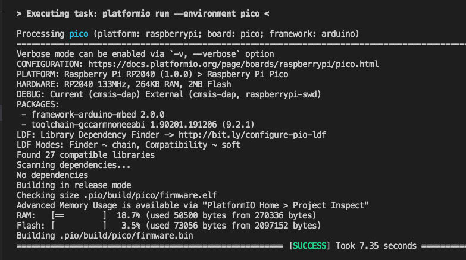
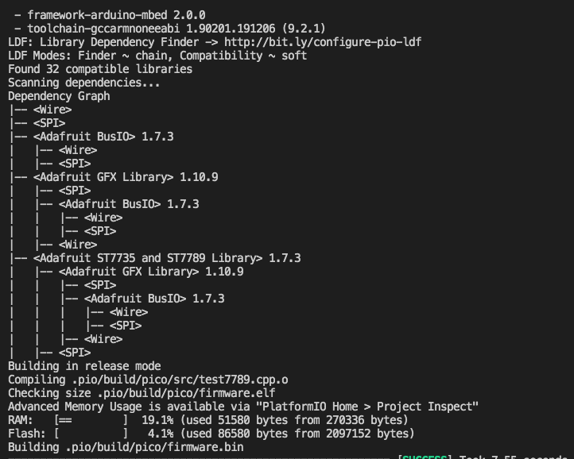
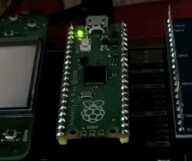

### PlatformIO.projects/testPico: Simple LED blinking for RPI-Pico Arduino w/ PlatformIO/VSCode 
 

### PlatformIO.projects/picoLCD: Simple SPI LCD(ST7789) for RPI-Pico Arduino w/ PlatformIO/VSCode 
 

### PlatformIO.projects/picoPIOLED: Simple PIO LED Blink for RPI-Pico Arduino w/ PlatformIO/VSCode 
Toggling the LED w/ PIO... 
### PlatformIO.projects/picoPIOLED: Simple PIO LED Blink for RPI-Pico Arduino w/ PlatformIO/VSCode 
Driving the LED w/ PIO-PWM... 

