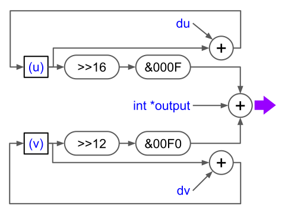

### PlatformIO.projects/testPico: Simple LED blinking for RPI-Pico Arduino w/ PlatformIO/VSCode 
 

### PlatformIO.projects/picoLCD: Simple SoftSPI LCD(ST7789) for RPI-Pico Arduino w/ PlatformIO/VSCode 
#### Also works for Arduino-Mbed HardSPI1 w/ ST7735 on PyBASE, see "PyBase7735.cpp" in the folder!  
 

### PlatformIO.projects/picoPIOLED: Simple PIO LED Blink for RPI-Pico Arduino w/ PlatformIO/VSCode 
Toggling the LED w/ PIO... 
### PlatformIO.projects/picoPIOLED: Simple PIO LED Blink for RPI-Pico Arduino w/ PlatformIO/VSCode 
Driving the LED w/ PIO-PWM... 
 
### PlatformIO.projects/picoNeoPixel: PIO Neopixels for RPI-Pico Arduino w/ PlatformIO/VSCode 
Adapted from Adafruit Neopixels Pico PIO 
  

### PlatformIO.projects/picoPIOLCD: PIO LCD logo rotating for RPI-Pico Arduino w/ PlatformIO/VSCode 
Ported from Pico-SDK, works for PicoKitB(ST7789) & PyBase(ST7735). 
Using 2 statemachine PIO for LCD writing; 
Hardware-Interpolation for bitmap affine transformation... 
  
 
 
 
### Reference
[Online PIOASM](https://wokwi.com/tools/pioasm) (GitHub source: https://github.com/wokwi/pioasm-wasm)
