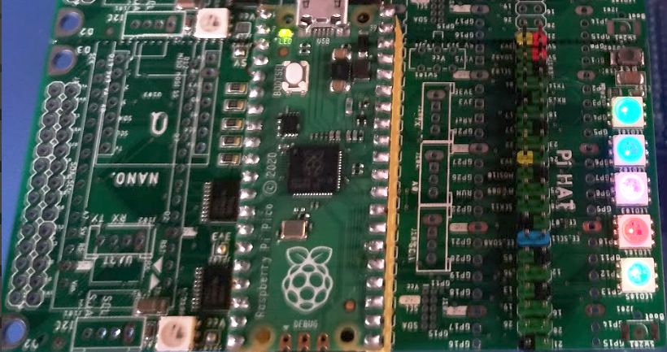

### Interesting projects based on RPi-Pico  _(Work-in-Progress)_ 
 
Another RPi-Pico, Arduino-Nano, Adafruit-QtPy/SEEED-Xiao + Pi interface!
With some added features:
 - Neopixel RGB LEDs.
 - Shared I2C, SPI, UART, A/D & SD card.
 - 5V/3V3 power source selectable.
 - SPI LCD interface w/ touch.
  
  
